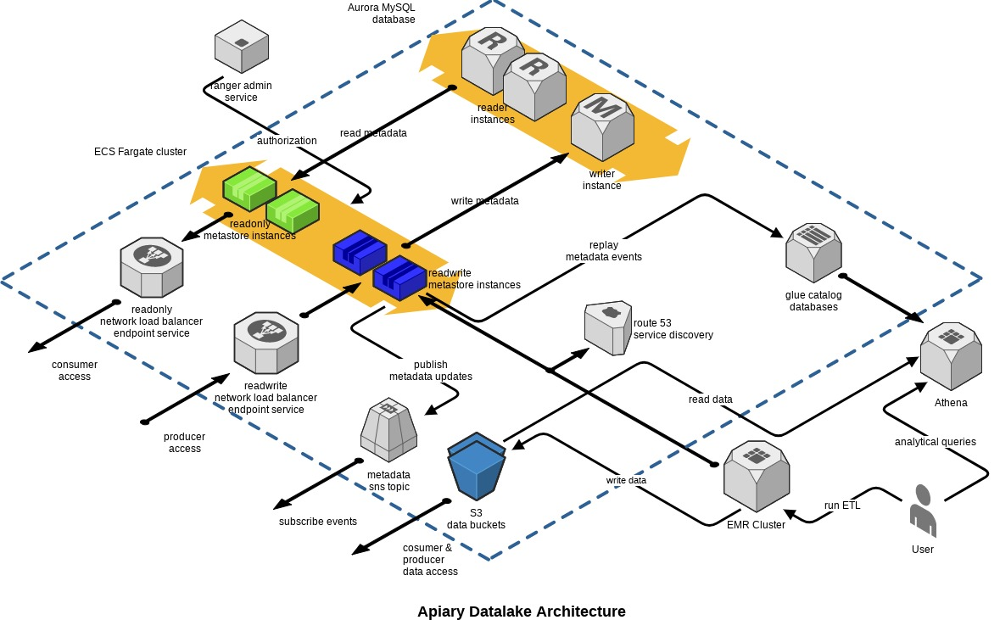

# Overview

 This repo contains a terraform module to deploy datalake component in Apiary project, module deploys various stateful components in a typical hadoop compatible datalake in AWS.


For more information please refer to the main [Apiary](https://github.com/ExpediaInc/apiary) project page.

## Architecture


## Key Features
    Higly-Available metastore service - packaged as docker container and running on ECS Fargate Cluster.
    PrivateLinks - Network load balancers and VPC endpoints to enable fedrated access to readonly and readwrite metastores.
    Managed schemas - integrated way of managing hive schemas, S3 buckets and bucket policies.
    SNS Listener - A hive metastore event listener to publish all metadata updates to a SNS topic, check [ApiarySNSListener](https://github.com/ExpediaInc/apiary-extensions/tree/master/apiary-metastore-listener) for more details.
    Gluesync  - A metastore event listener to replay hive metadata events in glue catalag.
    Metastore authorization - A metastore pre event listener to handle authorization using ranger.

## Usage

   example module invocation
```
module "apiary" {
  source        = "git::https://github.com/ExpediaInc/apiary-metastore.git?ref=v1.0.0"
  aws_region    = "us-west-2"
  instance_name = "test"
  apiary_tags   = "${var.tags}"

  private_subnets = [ "subnet1, "subnet2", "subnet3" ]
  vpc_id          = "vpc-123456"

  vault_addr          = "https://vault.internal.domain"
  vault_internal_addr = "https://vault.service.consul:8200"

  hms_docker_image             = "${aws_Account}.dkr.ecr.${aws_region}.amazonaws.com/apiary-metastore"
  hms_docker_version           = "1.0.0"
  hms_ro_heapsize              = "8192"
  hms_rw_heapsize              = "8192"

  apiary_log_bucket   = "s3-logs-bucket"
  db_instance_class   = "db.t2.medium"
  db_backup_retention = "7"

  apiary_managed_schemas   = [ "db1", "db2", "dm" ]
  apiary_customer_accounts = [ "aws_account_no_1", "aws_account_no_2"]
  ingress_cidr             = ["10.0.0.0/8"]
}

```
  check [variables.tf](variables.tf) for different options and usage

## Notes
  apiary metastore docker image is not yet published to a public repository, you can build from this [repo](https://github.com/ExpediaInc/apiary-metastore-docker) and publish to ECR.

  terraform module and docker container reads various vault secrets, you can create using following commands.
  ```
  vault write secret/apiary-test-us-west-2/db_master_user username=apiary password=xxxxxxxxxxxxxxxxxx
  vault write secret/apiary-test-us-west-2/hive_rouser username=hivero password=xxxxxxxxxxxxxxxxxx
  vault write secret/apiary-test-us-west-2/hive_rwuser username=hiverw password=xxxxxxxxxxxxxxxxxx
  ```

# Contact

## Mailing List
If you would like to ask any questions about or discuss Apiary please join our mailing list at

  [https://groups.google.com/forum/#!forum/apiary-user](https://groups.google.com/forum/#!forum/apiary-user)

# Legal
This project is available under the [Apache 2.0 License](http://www.apache.org/licenses/LICENSE-2.0.html).

Copyright 2018 Expedia Inc.
